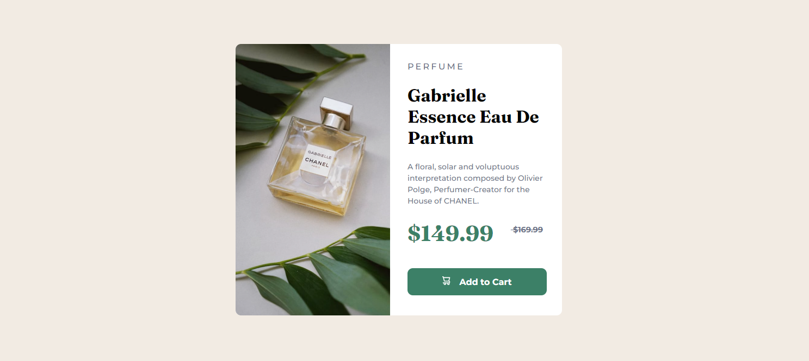

# product-preview-card-component-main  

   
 
This  is  a frontend  Project Challlenge   i have just complete.

  <h1 color="blue">Built  with</h1> 
       <ul>   
          <li>HTML5</li>  
           <li>SCSS</li>   
           <li>GRIDS</li>
        </ul>   
<h1>TO TAKE A LOOK AT MY CODE  HERE IT IS THE  URL </h1> 
 <a href="https://github.com/githukelvin/product-preview-card-component-main.git">Github Repo</a>  
 <h1>LIVE SITE</h1>
  <a href="https://githukelvin.github.io/product-preview-card-component-main/">Here is the live site</a>    
 <h1>HOW IT HELPED</h1> 
  
This  challenge  has  Helped me  to Utilize  my recent study  of  implemeting  sass  in  form of sass
  <h6>Happy coding  </h6> 
  <small>copy&2022 kelvin githu</small>